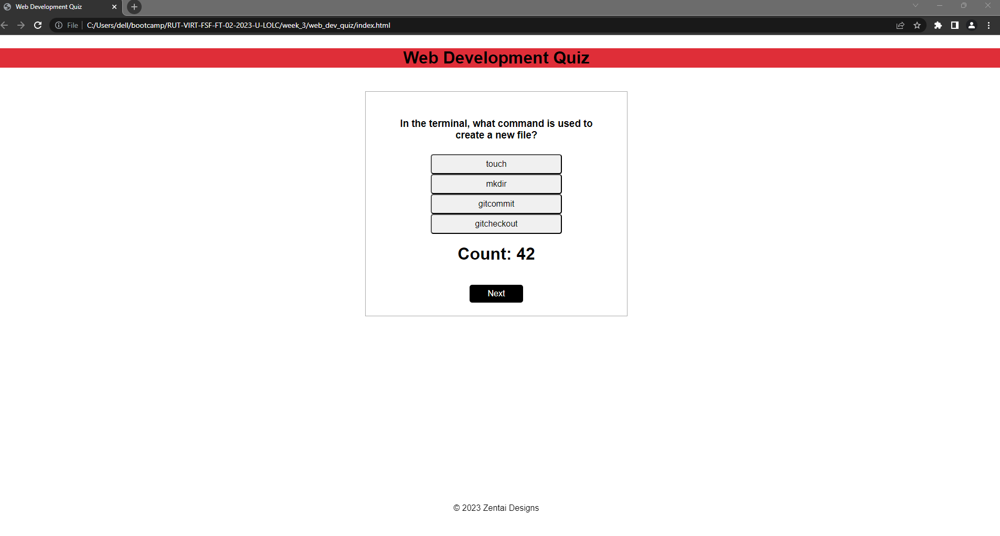

# web_dev_quiz

### License
This project is licensed under the MIT License  

https://opensource.org/licenses/MIT

## Table of Contents

### 1. [Description](#description)

### 2. [Installation](#installation) 

### 3. [Usage](#usage)

### 4. [Contributions](#contributions)

### 6. [Questions](#questions)

## Description
This project is intended to provide the user with a quiz to challenge their web development knowledge. The user is given 10 questions to answer in 45 seconds. If a question is answered incorrectly, time is decreased by 5 seconds. The user is able to log their initials and score and see their score history in local storage and their browser.

## Installation
For installation instructions, please see the project github repository: https://github.com/njd8927/web_dev_quiz

## Usage
To initialize application, please visit the deployed application's webpage URL: https://njd8927.github.io/web_dev_quiz/

## Contributions
This project was developed with assistance from JD Tadlock, Armando Osario, Andres Long, https://www.stackoverflow.com and MDN Web Docs.
To contribute to this project please see my github repository: https://github.com/njd8927/web_dev_quiz

## Questions
GitHub: https://www.github.com/njd8927

Email: nicholasz8687@gmail.com

## Mock-Up

The following image demonstrates the application functionality:

